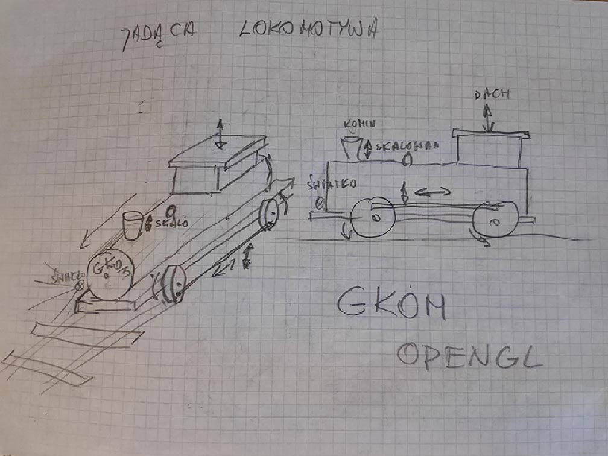

## Driving locomotive (jadąca lokomotywa) OpenGL

Simple model of locomotive with surroundings and lights implemented in C++ with OpenGL (GLEW, GLFW).

# Authors

Jarosław Glegoła - [KostkaBrukowa](https://github.com/KostkaBrukowa)

Rafał Lewanczyk

Roman Moskalenko - [skalermo](https://github.com/skalermo)

# Download

Use git clone to clone the repo.

```bash
git clone git@galeranew.ii.pw.edu.pl:GKOM.19L/ZP2-Lokomotywa.git
```

# Usage

Just open Visual Studio solution file (gkom-gl.sln) and run it in VS.

# Locomotive prototype photo


