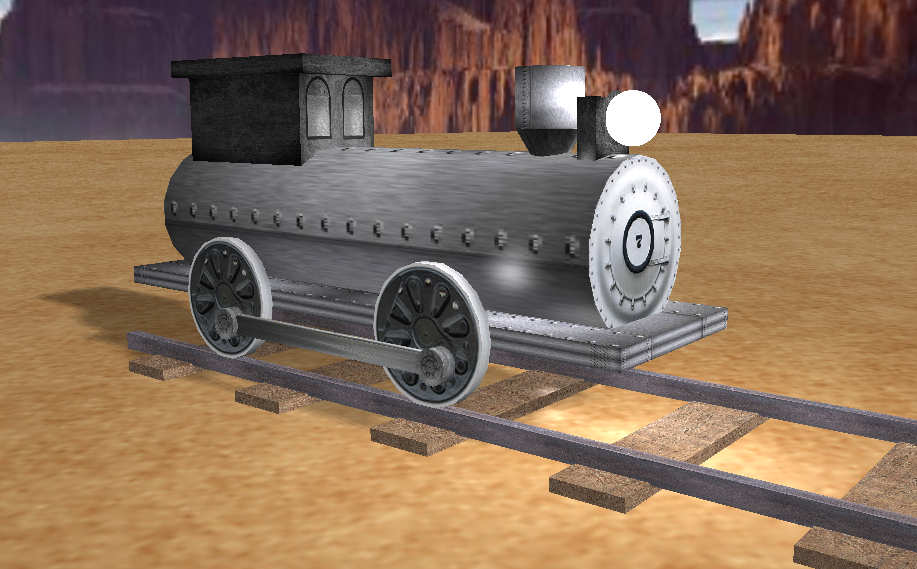

# Driving locomotive (jadąca lokomotywa) OpenGL

Simple model of locomotive with surroundings and lights implemented in C++ with OpenGL (GLEW, GLFW).

## Authors

Jarosław Glegoła - [KostkaBrukowa](https://github.com/KostkaBrukowa)

Rafał Lewanczyk - [rafallewanczyk](https://github.com/rafallewanczyk)

Roman Moskalenko - [skalermo](https://github.com/skalermo)

## Podział pracy

Roman Moskalenko:

Objekt "Cylinder", oświetlenie, cienie, cieniowanie, dół lokomotywy


Jarek Glegoła:

Obiekt Sphere, Cone, ShaderProvider, TextureProvider, reszta lokomotywy


Rafał Lewanczyk:

Obiekt Cube, tory kolejowe, kaktusy, Texture.h


## Download

Use git clone to clone the repo.

```bash
git clone git@galeranew.ii.pw.edu.pl:GKOM.19L/ZP2-Lokomotywa.git
```

## Usage

Just open Visual Studio solution file (gkom-gl.sln) and run it in VS.

## Locomotive prototype photo


## Final result of the lomotive

